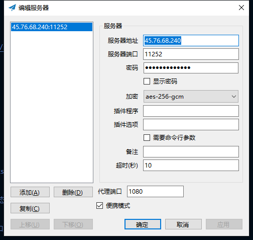
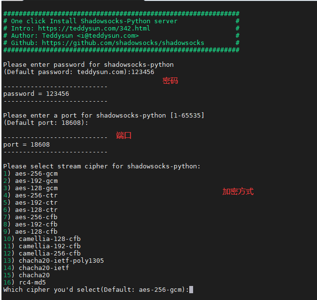

# shadowsocks 安装使用
本文只讨论安装,和简单firewalld影响,暂时不考虑selinux和其他网络安全影响

[shadowsocks.sh安装脚本](https://raw.githubusercontent.com/teddysun/shadowsocks_install/master/shadowsocks.sh)  
[hadowsocks.sh github](https://github.com/teddysun/shadowsocks_install)  
[shadowsocks windows客户端](https://github.com/shadowsocks/shadowsocks-windows)  
  

  1. 准备安装环境(gcc g++ make python)
  `
  yum -y install gcc gcc-c++ automake autoconf libtool make 
  yum -y install python2
  ln -s /usr/bin/python2 /usr/bin/python
  `
  2. 下载安装脚本
  `
  https://raw.githubusercontent.com/teddysun/shadowsocks_install/master/shadowsocks.sh
  `
  3. 运行安装
  `
  chmod +x shadowsocks.sh
  ./shadowsocks.sh 

  `
  该安装一共有四个输入项  
    
  a. 第一个: 连接密码  
  b. 第二个: 使用端口  
  c. 第三个: 加密方式 输入1,2,3 ... 选择 ,window客户端在连接时一定要使用对应得加密方式  
  d. 第四个: 按任意键确定开始执行安装  
  前三个选项也可以在安装完成后在/etc/shadowsocks.json  
   
   4. 检查安装
   命令行检测程序运行,第一次安装,不会为actity状态,可以start 该服务,无影响  
   ` systemctl status shadowsocks`  

   查看网络防火墙,若为使用状态,则需要开放指定端口,然后重启防火墙  
   ` systemctl status firewalld`  
   ` firewall-cmd --zone=public --add-port=11253/tcp --permanent`  
   ` firewall-cmd --zone=public --add-port=11253/udp --permanent`  
   ` firewall-cmd --reload`  
   
   4. 查看是否能在国内使用
   [中国端口扫描](http://tool.pfan.cn/scanport)
   [国外端口扫描](https://www.yougetsignal.com/tools/open-ports)
   先使用[国外端口扫描](https://www.yougetsignal.com/tools/open-ports)扫描端口,若端口为closed状态说明,该服务器没有开放对应端口,请查看服务器网络防火墙设置
   然后使用[中国端口扫描](http://tool.pfan.cn/scanport)扫描端口,若端口为closed状态说明(前提为国外端口扫描结果为open),该端口不能在国内使用
